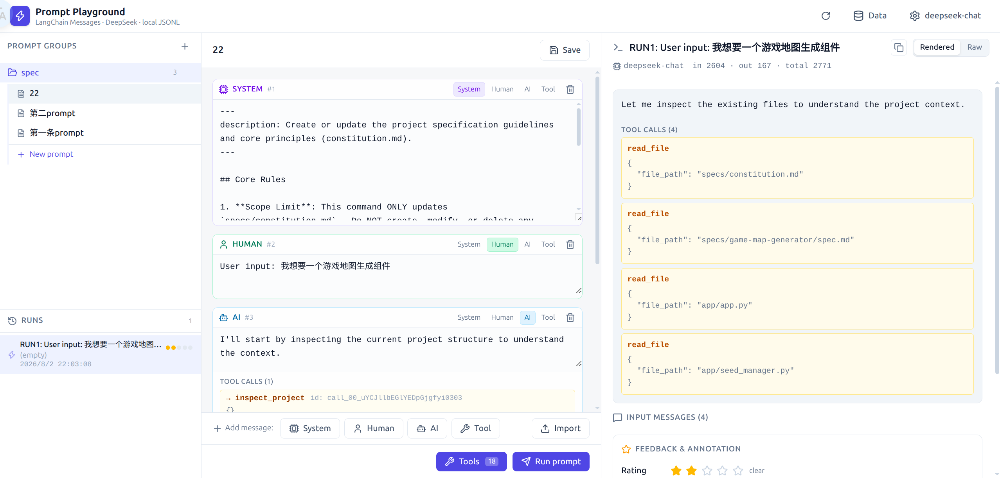

# Prompt Playground

一个纯前端的 LLM Prompt 调试工作台。编写多轮消息对话，对接 DeepSeek API 实时测试，观察工具调用（Tool Calling）行为并迭代优化。所有数据存储于浏览器 localStorage，无需后端。



## 功能

- **多轮消息编辑器** — 支持 system、human、ai、tool 四种角色，可自由增删排序
- **原生 LangChain 消息格式** — 导入导出均使用标准 `{type, data: {content, tool_calls, ...}}` 格式，与 LangChain 序列化完全兼容
- **流式输出** — 通过 DeepSeek API 实时流式返回，展示 token 用量统计
- **工具调用观察** — 内置 15 个默认模拟工具（代码搜索、文件读写、Web 搜索等），所有工具可编辑。将工具绑定到 Prompt 后运行，观察模型调用哪些工具及其参数 — 执行结果为模拟数据，无真实副作用
- **Python 工具扫描** — 提供 `scan_tools.py` 脚本，扫描 Python 项目中的 `@tool` 装饰函数，生成可导入的工具定义 JSON
- **运行历史** — 每次运行自动命名，保存流式输出、工具调用链和 token 统计，支持浏览和重命名
- **评分与反馈** — 支持星级评分、标签和评论，跟踪 Prompt 质量
- **双视图切换** — 运行结果支持 Rendered 视图（文本 + 工具调用卡片）和 Raw 视图（完整 LangChain `AIMessage` JSON）
- **分组管理** — 按 Group 组织 Prompt，支持多级分类
- **数据管理** — 通过 Data 面板浏览所有实体（groups、prompts、runs、settings、tools），支持卡片/原始文本两种查看模式
- **一键备份恢复** — Export All 打包所有数据为单个 JSON 文件；Import All 一键恢复。API Key 导出时自动保留为空
- **完全本地** — 所有数据存储在浏览器 localStorage（JSONL 格式），无需服务器、数据库或账号

## 技术栈

| 层 | 技术 |
|---|---|
| UI | React 19 + Tailwind CSS 4 |
| LLM | LangChain JS (`@langchain/deepseek`) |
| 模型 | DeepSeek Chat API |
| 图标 | Lucide React |
| 构建 | Vite 8 |

## 快速开始

### 环境要求

- Node.js 18+
- [DeepSeek API Key](https://platform.deepseek.com/api_keys)

### 安装运行

```bash
npm install
npm run dev
```

打开 `http://localhost:7991`，点击右上角齿轮图标设置 API Key，即可开始编写 Prompt。

### 生产构建

```bash
npm run build
npm run preview
```

## 使用指南

### 基本对话

1. 在左侧边栏选择一个 Group（默认已有一个 "General" 分组）
2. 编写 system 消息和 human 消息
3. 点击 **Run prompt**（或按 `Ctrl+Enter`）
4. 右侧面板实时流式展示模型回复
5. 可对输出进行星级评分、添加标签和评论

### 导入消息

点击编辑器底部的 **Import** 按钮，粘贴原生 LangChain 消息 JSON 数组即可批量导入。支持格式：

```json
[
  { "type": "system", "data": { "content": "You are a helpful assistant." } },
  { "type": "human", "data": { "content": "Hello!" } },
  { "type": "ai", "data": { "content": "Hi there!", "tool_calls": [...] } },
  { "type": "tool", "data": { "content": "...", "tool_call_id": "call_xxx", "name": "read_file" } }
]
```

### 工具调用测试

1. 点击编辑器底部的 **Tools** 按钮，打开工具管理面板
2. 左侧列表：勾选需要绑定的工具。底部 **Add tool** 按钮可新增工具
3. 右侧表单：填写工具名称、描述、参数 JSON Schema 和模拟输出
4. 编写可能触发工具调用的 Prompt（如 "查找项目中所有认证相关的函数"）
5. 点击 **Run prompt** — 模型会选择直接回复或调用一个或多个工具
6. 在右侧 Run Panel 中切换 **Rendered** / **Raw** 视图查看结果

### 扫描 Python @tool 函数

使用内置扫描脚本从 Python 项目中提取工具定义：

```bash
# 扫描目录，输出 JSON 到标准输出
python scripts/scan_tools.py /path/to/your/project

# 写入文件
python scripts/scan_tools.py /path/to/your/project -o my_tools.json

# 格式化输出
python scripts/scan_tools.py /path/to/your/project --pretty
```

也可通过 Tools 面板中的 **scan_tools.py** 按钮直接下载脚本。点击后会弹出保存位置选择对话框。

扫描器可检测 `@tool` 装饰器函数，提取：
- **函数名** → 工具名称
- **Docstring** 或 `@tool("描述")` 参数 → 工具描述
- **类型注解**（`str`、`int`、`bool`、`list[X]`、`Optional[X]`、`Literal[...]`）→ JSON Schema 类型
- **默认值** → 可选参数（从 `required` 中排除）
- **Google 风格 docstring `Args:` 部分** → 参数描述

函数体**不会被**提取 — 工具执行始终为模拟。

### 分组与组织

- **Groups**（左侧边栏）— 创建如 "代码审查"、"文档生成"、"实验" 等分组
- **Prompt** 位于 Group 内部。每个 Prompt 包含一组消息 + 工具绑定
- **Run** 展示在 Prompt 下方。每条 Run 记录包含输入消息、输出结果和元数据

### 数据备份与恢复

- 点击工具栏 **Data** 按钮打开数据管理器
- **Cards** 视图：以卡片形式浏览记录，可展开查看 JSON、删除记录
- **Raw** 视图：直接编辑底层 JSONL 文本，编辑后点击 Save 持久化
- **Export All**：将所有数据（groups、prompts、runs、settings、tools）打包为一个 `prompt-playground-backup.json` 文件下载。API Key 导出时自动清空
- **Import All**：导入之前导出的备份文件，一键恢复所有数据

## 设置

通过右上角齿轮图标 **Settings** 配置：

| 选项 | 默认值 | 说明 |
|---|---|---|
| API Key | *(必填)* | DeepSeek API 密钥 |
| Base URL | `https://api.deepseek.com/v1` | API 端点（支持代理） |
| Model | `deepseek-chat` | 模型名称 |

Temperature 固定为 `0`（确定性输出），`max_tokens` 不设限制（模型默认值）。

## 内置工具

首次启动时自动写入 15 个默认工具到 localStorage：

| 类别 | 工具 |
|---|---|
| 代码搜索 | `ast_search`、`find_symbol_definition`、`find_symbol_references` |
| 代码阅读 | `read_file`、`inspect_file_summary`、`inspect_project` |
| 代码编辑 | `write_to_file`、`create_file`、`delete_files`、`apply_search_replace` |
| 分析 | `static_check` |
| 环境 | `get_environment_variable` |
| Web / 时间 | `web_search`、`get_current_time` |
| 配置 | `setup_spec_environment` |

所有工具均可自由编辑、删除或新增。工具定义支持 JSON 导入导出。执行结果始终为模拟数据。

## 项目结构

```
prompt-playground/
├── public/                  # 静态资源
├── src/
│   ├── main.jsx             # 入口
│   ├── App.jsx              # 主应用：状态管理与调度
│   ├── Sidebar.jsx          # 左侧导航：Groups、Prompts、Runs
│   ├── MessageEditor.jsx    # 多轮消息编辑器
│   ├── RunPanel.jsx         # 运行结果展示（Rendered / Raw 视图）
│   ├── SettingsModal.jsx    # API Key 和模型设置
│   ├── DataModal.jsx        # 数据管理器（Cards / Raw 视图）
│   ├── ToolsModal.jsx       # 工具管理（左侧列表 + 右侧编辑表单）
│   ├── ImportMessagesModal.jsx  # 消息导入弹窗
│   ├── store.js             # localStorage JSONL 持久化层
│   ├── llm.js               # LangChain DeepSeek 集成
│   ├── tools.js             # 工具注册表（从 store 读取）
│   ├── messages.js          # 消息解析与格式转换
│   └── default-tools.js     # 默认工具定义（首次启动写入）
├── scripts/
│   └── scan_tools.py        # 扫描 Python @tool 函数 → 可导入 JSON
├── index.html
├── package.json
└── vite.config.js
```

数据流：用户编辑 Prompt → `App.jsx` 调度 → `llm.js` 调用 DeepSeek → 结果通过 `store.js` 保存 → UI 由 `RunPanel.jsx` 渲染。所有持久化经 `store.js` 写入 localStorage（换行分隔 JSON 格式）。

## License

MIT
